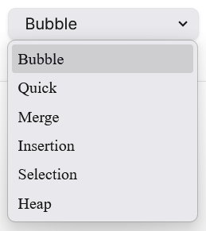

# Algorithm Visualizer
Dive into the world of sorting algorithms through interactive visualizations. Watch how popular algorithms like Bubble Sort, Merge Sort, and Quick Sort organize data step by step. Perfect for learning, teaching, or just satisfying your curiosity.

## Languages and Frameworks Used

### Try It!
Live on [subs-algo-visualizer.vercel.app](https://subs-algo-visualizer.vercel.app/)
 
Or download Source code directly form [here](https://github.com/1ofx9/algo-visualizer/archive/refs/heads/main.zip).

### How to use?

Navigate to the algorithm sorting page.

Now you can enter your own array to sort, or use the "Generate Random Array" button to generate an array.

After that, use the easy-to-use controls to select your speed and algorithm, then start sorting the array.

Using the dropdown menu, you can select the algorithm you want from the listed options.

</img>

Before sorting

During sorting process

After sorting

ta da~

### License
 
This project is licensed under The MIT License.

its a simple algorithm visualizer thats it :)
